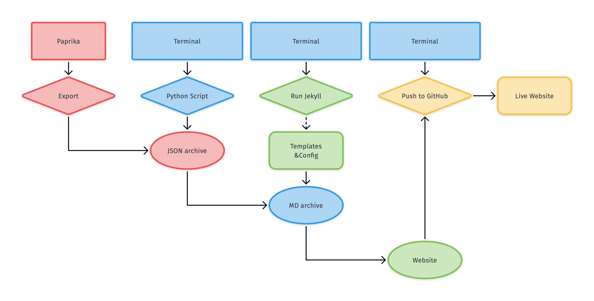
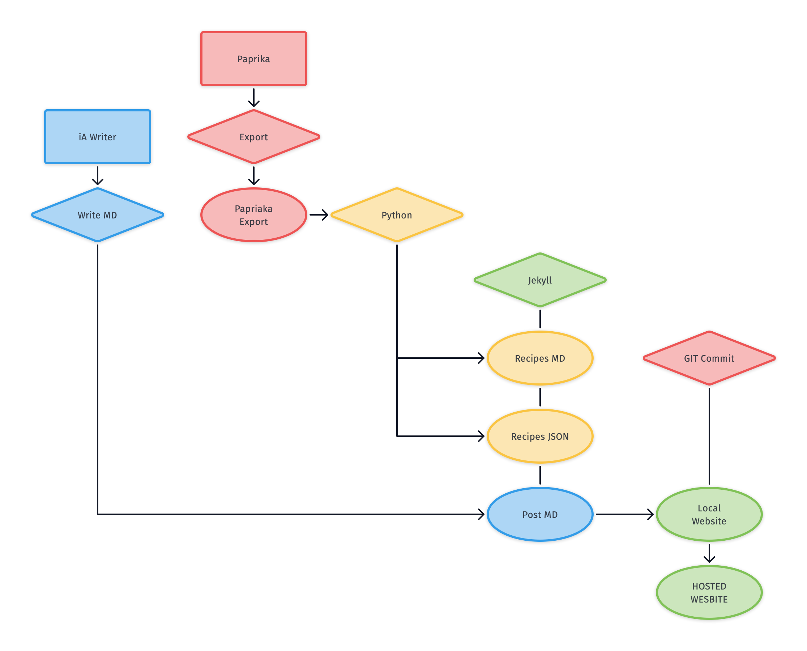

# joi.github.io
## Currently a testbed for publishing my recipes.
---
## System Design
### v1

### v2


## To Do
We will flesh out the architecture as we go, figuring out where scripts etc will live in Joi's computer.

- [x] Pseudo-code for Paprika export parser
- [x] Shell script to run parser, Jekyll build and Git commit
- [x] Figure out a process for getting Paprika exports into the right place for our parser.
- [ ] Atomize the HTML parse
- [ ] Test splicing recipe HTML into "Lab Notes" recipe posts from JSON
- [ ] Jekyll templates for rendering the site

# Notes
## Sources Directory
Added a "data" directory. Should look like this:
```
./__scripts
	└── ParsePaprika.ipynb
	└── data
			├── My\ Recipes
			├── My\ Recipes.zip <-- HTML Paprika Export
			├── My\ Recipes.paprikarecipes <-- Paprika Export
			└── old
 ```
 
 **Note:** For now, please manually unzip the "My Recipes.zip" by double-clicking it. Python mucks up the file names and haven't quite figured out how to get around that yet.
 
## Photos
1. Most but not all recipes have a photo attached from the source. 
	- **Maybe Copyrighted**
	- ```d['photo_data']```
2. Photos Joi adds to recipes in Paprika are embedded in the JSON AND included in the HTML export's images/ DIR.
	- ```d['photos'][0]['data']```
	- ```__scripts/data/My Recipes/Images/```

Because we have all photos (sources' as smallish thumbs, and Joi's at reasonable size) in the HTML export's /Images folder, we can delete all the image data and hashes from the JSON dumps, and not include them in the Markdown, saving duplication and useless storage/transfer.

The Python script now copies the /Images folder from the unzipped export over into the Jekyll root /images folder, where it is renamed "/recipes".

That means on the published website, recipe images have URI like
"```/images/recipes/foo/bar.jpg```"

## Markdown recipes
Because we have all the data in the JSON dumps, including the recipe HTML (ingredients, directions), we can render that into the Jekyll templates directly and manipulate layouts better than if we dump into Markdown.

For this reason, the Markdown created by the script will only generate stubs/placeholders for the generation of the Jekyll pages (which as mentioned will splice in data from the _data/ folder via the recipe.html layout template).

## HTML
Things to parse out more atomically _(right now I am just grabbing the whole body text more or less)_
* Description
* Ingredients
* Directions
* Nutritional Information
* Notes

To leave out (_because we have it in the data_)
* Photo
* Rating
* Prep time
* Cook time
* Servings
* Source
* Categories

## "Lab Notes" Recipe posts
By adding the filenames of any recipes mentioned in a post to its "front matter", we can also splice in whatever data from the recipes we want, as well as link to their pages.
* Linked Mentions
* Unlinked Mentions